# Report for Assignment 1 - Group 10

## Project chosen

Name: **Django**

URL: **https://github.com/django/django**

Number of lines of code and the tool used to count it: we used Lizard to count the number of lines and the number of lines is 383659. However, excluding all other directories like `tests` and `docs`, by only focusing on the `django` directory and setting `-l python` in the Lizard arguments, the number of lines comes down to **112389**.
```bash
# The following assumes that we are currently in the root directory of the Django repository.
lizard django/ -l python
```

Programming language: **Python**

## Testing Framework
We have added this small section to the report, in order to provide some basic information of how the Django Test Suite functions.

Django provides a test suite that is used to test the Django codebase. The test suite is located in the `tests` directory of the Django repository. The test suite is run using the `runtests.py` script, which is located in the `tests` directory, and contains the hashbang to run with the default Python installation of the system.

The test suite supports options such as a `--settings` argument, which allows the user to pass some default settings for the Django environment. In our case, we are using the default settings provided by Django, `test_sqlite.py`, which include using an SQLite database, among others.

The test suite also supports a `--parallel` argument, which allows the user to set how many tests are set in parallel. The default value is calculated based on the available cores, however in some cases we have chosen to set this to `1`, due to conflicts with our custom coverage instrumentation. This will be mentioned explicitly, where used.

Finally, passing the name of a test module will run only the tests in that module. This is useful for running specific tests, as running the entire test suite can take time. For example, if one of us is working on the `mail` module, we can run only the tests in that module by running `./runtests.py mail --settings=test_sqlite`.

## Coverage measurement

### Existing tool

We used **coverage.py** to check the coverage of the repository, and it turned out to be 78%.

We ran the following commands, as mentioned in the [Django Unit Test Documentation for Contributors](https://docs.djangoproject.com/en/dev/internals/contributing/writing-code/unit-tests/#code-coverage):
```bash
# The following assumes that we are currently in the root directory of the Django repository, and in the created virtual environment.
cd tests
pip install coverage
pip install -e ..
pip install -r requirements/py3.txt
coverage run ./runtests.py --settings=test_sqlite # Runs the tests with coverage and using the SQLite adapter.
coverage combine # Combines the coverage data from all the test runs.
coverage html # Generates the HTML coverage report.
```

The above yields the following coverage report, accessible at /tests/coverage_html/index.html:
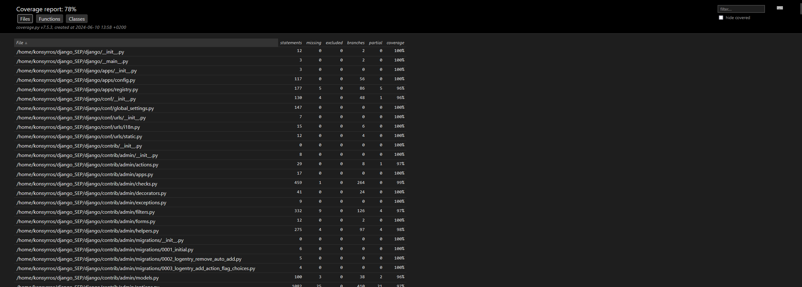

More details regarding the coverage of the chosen functions will be provided in the following sections, as Django is a big project, so here we are only showing the overall result.

### Your own coverage tool

#### Konstantinos Syrros (ksy201)

##### /django/core/mail/backends/filebased.py : EmailBackend -> \_\_init\_\_

The relevant function is the `__init__` function of the `EmailBackend` class in the `filebased.py` file. The function is responsible for initializing the `EmailBackend` class for Django to have a dummy email backend, where all emails are treated as locally stored files. The function essentially carries out all required actions regarding the directory where the email files are to be stored.

Due to the nature of the tests and this function, I ran across the issue where the class was getting initialized multiple times. The parallel nature of the tests also did not help when trying to get a consistent coverage. Even when putting the coverage datastructure outside the class as global, I would still come across inaccurate results. Thus, I opted for the following:
- Store the datastructure in an external JSON file called `my-coverage.json`, load it every time the function is called, and update it accordingly.
- Use `--parallel=1` when running the tests, in order to avoid issues with the parallel nature of the tests, both when it comes to the coverage itself and the file operations.
- The aforementioned JSON file will get updated, and for reproducibility, I have also included the original `my-coverage-base.json` file alongside. The process is to copy the base file to `my-coverage.json` before running the tests. While this is not the most efficient way to handle the coverage, and creating a wrapper tool to encapsulate and handle all this, as well as output everything in a more user-friendly manner, would be the ideal solution, I believe that it falls outside the scope of this assignment, and would come closer to recreating the structure of `coverage.py`.

[Relevant Commit](https://github.com/Aryansharma28/django_SEP/commit/aeba14c6156b3700f2039d986cd2a989f5886b58)

In the above commit you can see the instrumentation of both Function 1 and Function 2, since they were instrumented at the same time.

The results of the instrumentation can be seen below:

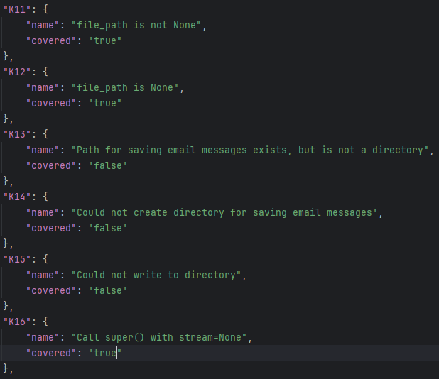

It can be seen that they indeed reflect the coverage, as measured by `coverage.py`:

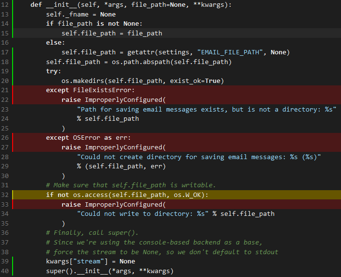

The initial coverage of this function was 50%.

##### /django/core/mail/backends/filebased.py : EmailBackend -> open

This function is part of the same file and class as the previous function. The `open` function is responsible for opening the file (stream) where the email is to be stored. I chose to follow the same instrumentation technique as described earlier.

[Relevant Commit](https://github.com/Aryansharma28/django_SEP/commit/aeba14c6156b3700f2039d986cd2a989f5886b58)

In the above commit you can see the instrumentation of both Function 1 and Function 2, since they were instrumented at the same time.

The results of the instrumentation can be seen below:

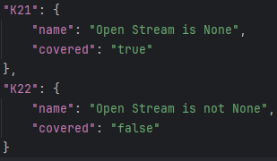

It can be seen that they indeed reflect the coverage, as measured by `coverage.py`:

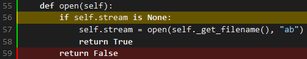

The initial coverage of this function was 50%.

#### Christina Benopoulou (cbe248)

##### /django/core/files/utils.py : FileProxyMixin -> readable

##### /django/core/files/utils.py : FileProxyMixin -> writable

I used two dictionaries to monitor and update the coverage status of the conditional branches as the program executed:

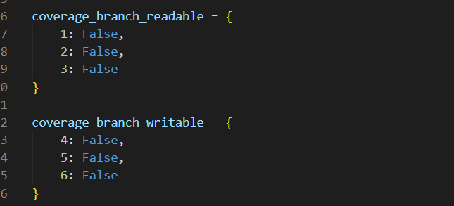

To track whether each conditional branch was reached, I added a line before each branch that sets a flag if the branch is executed. Here’s how it looks:

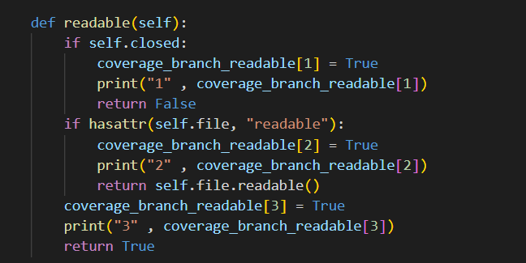
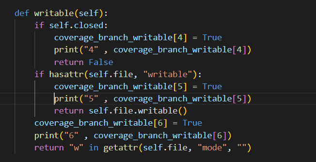

After adding these lines, I ran the tests with the command: 

`coverage run ./runtests.py --settings=test_sqlite files`

The printed results show which branches were executed and marked as True during the tests:

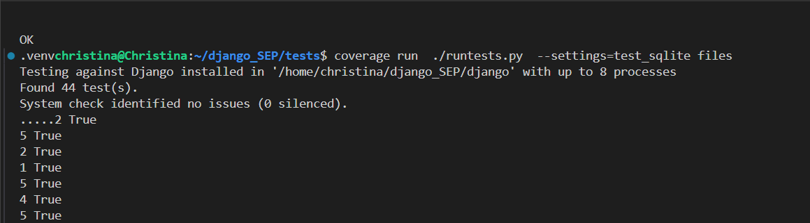
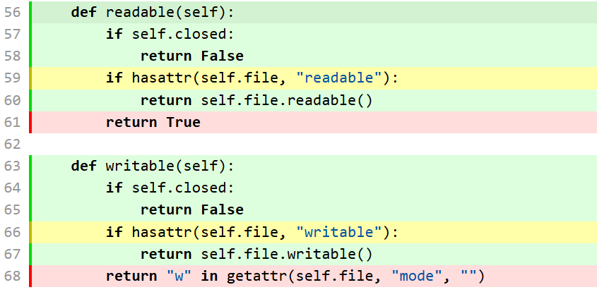

Each number corresponds to a specific branch in the readable or writable functions. The branches printed with True indicate that they were executed. 

Branches 3 and 6 (lines 61 and 68 respectively) were not printed because they were not reached during the execution of the tests. This indicates that those specific branches did not have their conditions met to be executed and were therefore marked as False.

Branch coverage is measured using the following formula:

`number of executed branches / total number of branches x 100`

For these two functions, the branch coverage is: 2/3 * 100 = 66.6% 

By analyzing these results, we can identify which parts of the code need additional test cases to achieve full coverage.

Below is a link to the commit made in our forked repository  that shows the instrumented code to gather coverage measurements and depicts the steps I mentioned above: 

[Coverage tool](https://github.com/Aryansharma28/django_SEP/commit/f4cbc9c616bb3659e8165eef6191183336d1017e)

#### Maria Claudia Montalvo (cmo209)

##### /django/utils/module_loading.py -> module_dir

The data structure I chose to hold the coverage information about the conditional branches was a dictionary, which is visible here: 

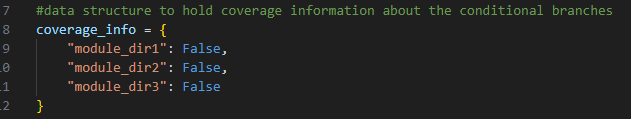

The module_dirs function had 3 main branches, for each of which I added flags to determine whether they had been executed or not:

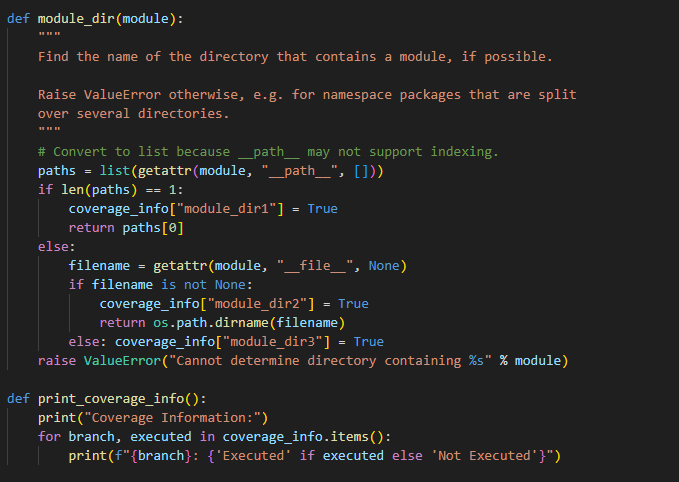

As is observable, each of the flags get triggered if the branch is executed. I have also created a print_coverage_info() function to print the coverage information to the console. Once that was completed, I ran the following command to the console: 

`coverage run ./runtests.py --settings=test_sqlite migrations`

This runs the coverage specifically within the migrations folder, that is, where the module_loading file and thus the module_dir function is located. The reason for this is to not have to check coverage for the whole project and reduce runtime. The output of this command on the console was as follows: 

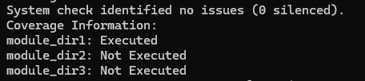
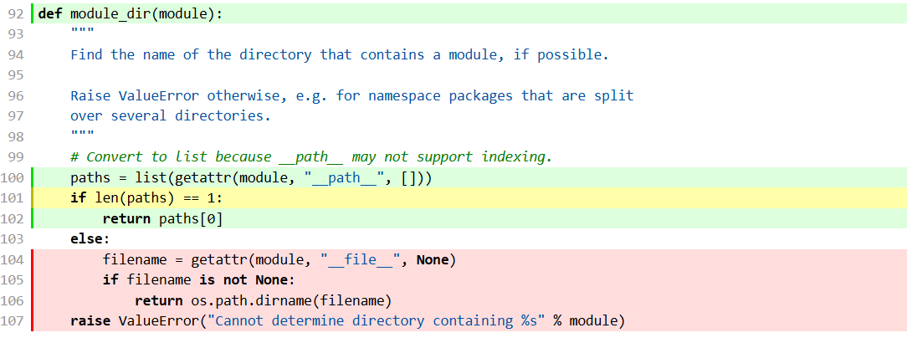

Each of these module_dir# represents each of the 3 branches, and showcases whether they are being executed or not. At the moment the only branch that is being reached is module_dir1. 

To measure branch coverage, the following formula is used:

`number of executed branches / total number of branches x 100`

For this function, the number of executed branches is 1 and the total number of branches is 3. Following this:

`1 / 3 x 100 = 33.3`

So the current total branch coverage is 33.3%. Using this coverage instrumentation, it is now possible to determine the sections of the function that need enhanced testing to increase branch coverage.

The link to the relevant commit regarding the instrumented code used to make the coverage measurements can be found below:

[Relevant Commit](https://github.com/Aryansharma28/django_SEP/commit/be7a529e0c67bc42c8662b0cd97a1ad364c56002)

##### django/template/autoreload.py -> get_template_directories


The data structure I chose to hold the coverage information about the conditional branches was a dictionary, which is visible here: 

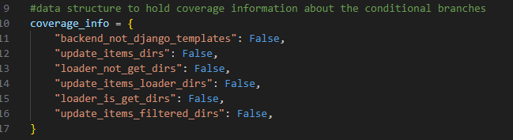

The get_template_directories function had 6 main branches, for each of which I added flags to determine whether they had been executed or not:

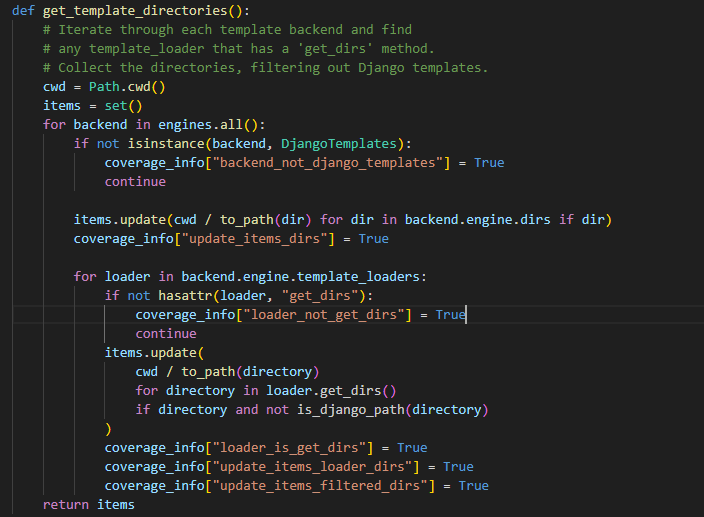

As is observable, each of the flags get triggered if the branch is executed. I have once again, created a print_coverage_info() function like above to print the coverage information to the console (not visible on the screenshot but same code). Once that was completed, I ran the following command to the console: 

`coverage run ./runtests.py --settings=test_sqlite template_tests`

This runs the coverage specifically within the template_tests folder, that is, where the autoreload file and thus the get_template_directories is located. The reason for this is to not have to check coverage for the whole project and reduce runtime. The output of this command on the console was as follows: 

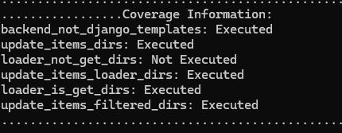
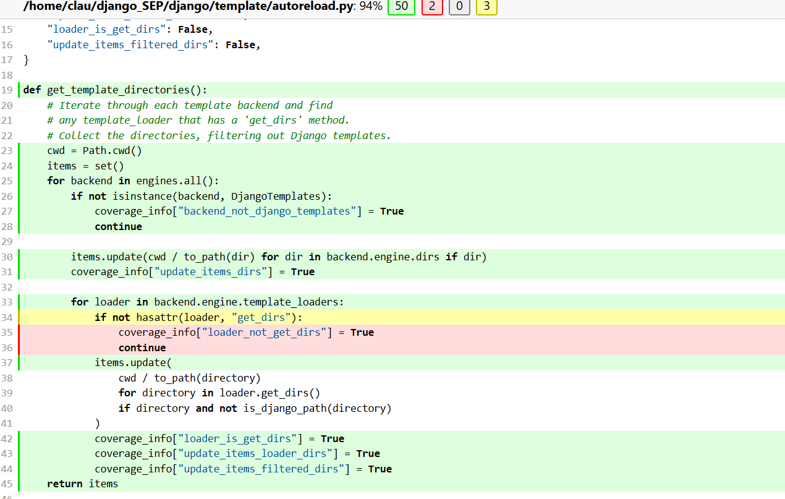

Each of these represents one of the 6 branches, and showcases whether they are being executed or not. At the moment the only branch that is not being reached is that of loader_not_get_dirs, that is, the branch where it is tested if the loader that was fetched from the template backend has a 'get_dirs' method or not. 

To measure branch coverage, the following formula is used:

`number of executed branches / total number of branches x 100`

For this function, the number of executed branches is 5 and the total number of branches is 6. Following this:

`5 / 6 x 100 = 83.3`

So the current total branch coverage is 83.3%. Using this coverage instrumentation, it is now possible to determine the sections of the function that need enhanced testing to increase branch coverage.

The link to the relevant commit regarding the instrumented code used to make the coverage measurements can be found below:

[Relevant Commit](https://github.com/Aryansharma28/django_SEP/commit/e458112796b0f3014f089149d8bfcb46cfe93ed8)

#### Aryan Sharma (ash288)

print coverage:

This is a common function that i have used for both of the funcitons to check the coverages! :)


##### 1.django/http/request.py -> get_signed_cookie() 

I used dictionaries to monitor and and update the coverage status of the conditional branches as the program executed:


The get signed cookies had 4 branches in that it could go to which were the if and the elses of all the try blocks and I added flags to determine whether they had been executed or not:


As is observable, each of the flags get triggered if the branch is executed. I have also created a print_coverage() function to print the coverage information to the console. Once that was completed, I ran the following command to the console:


`coverage run ./runtests.py --settings=test_sqlite signed_cookies_tests`


>


This shows that out of the 4 paths, 2 paths are being covered and the other 2 branches are not being executed. at the moment only branch 3 and 4 are being reached.

To measure branch coverage, the following formula is used:

`number of executed branches / total number of branches x 100`

For this function, the number of executed branches is 2 and the total number of branches is 4. Following this:

`2 / 4 x 100 = 50%`

So the current total branch coverage is 50% . Using this coverage instrumentation, it is now possible to determine the sections of the function that need enhanced testing to increase branch coverage.

The link to the relevant commit regarding the instrumented code used to make the coverage measurements can be found below:

[Relevant commit](https://github.com/Aryansharma28/django_SEP/commit/67e9e3f7e2c24ab9b9cd9241162dc609f4f4b5a0#diff-c16850633accaf26c845d9ad94325d4fd296af7fdf63d79836cb55b69d2cd75c)

##### 2. django/contrib/auth/tokens.py
The data structure I chose to hold the coverage information about the conditional branches was a dictionary, which is visible here:


The function at hand had 8 main branches, for each of which I added flags to determine whether they had been executed or not:


As is observable, each of the flags get triggered if the branch is executed. I have once again, created a print_coverage() function like above to print the coverage information to the console . Once that was completed, I ran the following command to the console:

'coverage run ./runtests.py --settings=test_sqlite auth_tests'


Each of these represents one of the 8 branches, and showcases whether they are being executed or not. At the moment the only branch that is not being reached is that of branch 2 and branch 3, that is, the branch where it is tested if the loader that was fetched from the template backend has a 'get_dirs' method or not. 

To measure branch coverage, the following formula is used:

`number of executed branches / total number of branches x 100`

For this function, the number of executed branches is 6 and the total number of branches is 8. Following this:

`6 / 8 x 100 = 75%`

So the current total branch coverage is 75%. Using this coverage instrumentation, it is now possible to determine the sections of the function that need enhanced testing to increase branch coverage.

The link to the relevant commit regarding the instrumented code used to make the coverage measurements can be found below:

[Relevant commit](https://github.com/Aryansharma28/django_SEP/commit/67e9e3f7e2c24ab9b9cd9241162dc609f4f4b5a0#diff-b93dda4cd6422ff34822c0dcb5f4d89f4c9634093c4220f9acd267535b007be4)

## Coverage improvement

### Individual tests

#### Konstantinos Syrros (ksy201)

##### /tests/mail/tests.py : MailTests -> test_backend_arg

This test is part of the `MailTests` class in the `tests.py` file in the `mail` module. The test is responsible for checking whether the provided backend is properly configured and initialized. This test is rather large by default and covers various backends. Since the two functions I have chosen to instrument are part of the same backend, they are both tested under this one test. However, different test cases, specifically 4 of them, have been added under this test function, to cover both functions. My implementations can be found between lines 826 and 862 (inclusive).

[Relevant Commit](https://github.com/Aryansharma28/django_SEP/commit/c3c095719425b01dd6ff05a4ca6ab59899a2abcc)

###### Tests for Function 1 (EmailBackend -> \_\_init\_\_)

It was relatively effortless to derive the test cases needed to cover this function, as they mostly revolved around improper configuration, and raised the related errors. However, there were no test implementations to check those cases. The first case was to check whether the path provided is not a directory, the second was if the directory could not be created for any generic OS Error, and the third one was whether the directory could not be written to.

When writing the tests, I followed the Django structure as it was implemented in the other tests. For the first test, I created a temporary file, passed its path to the backend, and checked whether the proper exception with the appropriate message was raised. For the second test, I used a mock patch to the `makedirs` call, forcing it to throw an `OSError` as a side effect. I then proceeded to call the backend, and checked if the error was thrown with the appropriate message. For the third test, I created a temporary directory, set its permissions to 444, making it read-only, and passed it to the backend, checking whether the proper exception with the appropriate message was raised.

The old coverage results for this function, as aforementioned, are (50%):


The implementation of the tests led to 100% coverage of the function, as seen below:
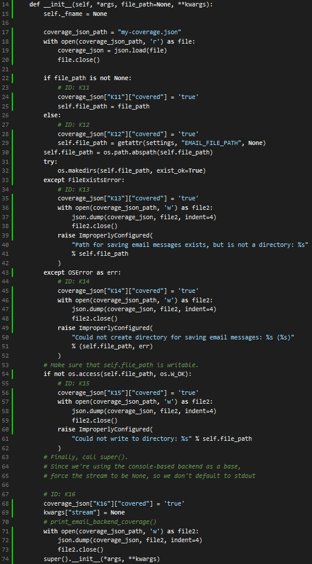

As aforementioned, the initial coverage of the function was 50% and was increased to 100%, a 100% increase. The reason for this is that the uncovered parts of the function were the exceptions for handling edge cases. With the addition of each test, the conditions for those branches are now met, and the code inside is reached, increasing the coverage.

###### Tests for Function 2 (EmailBackend -> open)

The second function was a bit more challenging to derive the test cases for, as it did not include descriptive error messages. The function would succeed if the stream passed to the backend was None, and would return False if the stream was not empty. The first case was covered as it is the default implementation, and the second case was not covered at all. After going through the implementation of the backend more thoroughly, I derived that this is the expected behavior. Thus, for the tests, I chose to create a simple String Stream, and pass it to the backend, then calling the `open()` function of the backend to see its behavior. Indeed, it returned false, and the test for it was produced.

The old coverage results for this function, as aforementioned, are (50%):


The implementation of the tests led to 100% coverage of the function, as seen below:
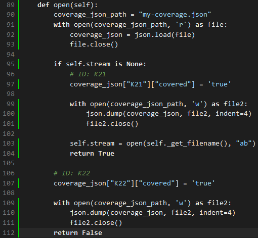

As aforementioned, the initial coverage of the function was 50% and was increased to 100%, a 100% increase. The reason for this is that the non-default case of the Stream not being empty has now been covered. This is not a case that would be reached in the default implementation, but with the test case created, the conditions for this branch can be reached, and thus, the coverage is increased. While it is unlikely that this branch will be reached during normal Django operation, it is still important to have it covered, as it is part of the function's implementation, and should be tested for failsafe reasons (to account for potential system failures).

For completeness, the output of my custom implementation of the coverage tool is also provided below:
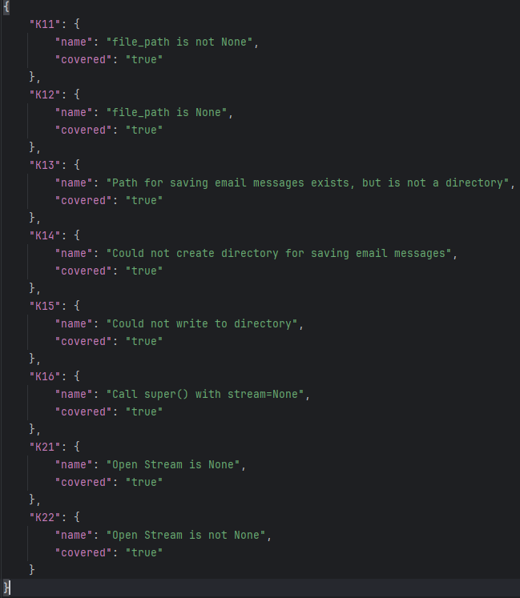

#### Christina Benopoulou (cbe248)

##### /tests/files/tests.py : def readable()
##### /tests/files/tests.py : def writable()

Below are the coverage results before adding the new test cases. As mentioned earlier, the current coverage for each function stands at 66.6%. My goal is to achieve 100% coverage, and I will share the steps I took to reach this goal further below.


After identifying the appropriate tests for the functions, I improved branch coverage by enhancing the existing test cases.

Next, I re-ran the following command:

`coverage run ./runtests.py --settings=test_sqlite files`

This time, the printed results depicted True values for all six branches, indicating full coverage:

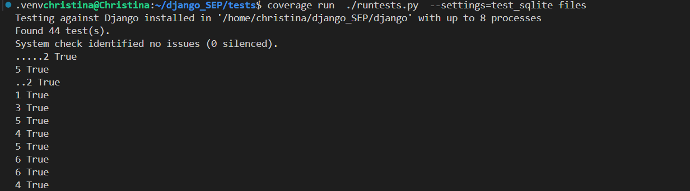

To visualize the coverage, you can run the following commands:

`combine coverage`

`combine html`

`explorer.exe .\\coverage_html\\index.html`

Then, the result will be:

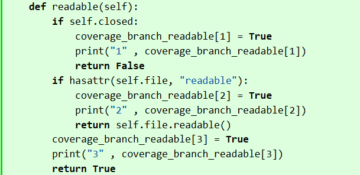
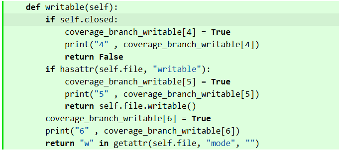

To sum up , the readable and writable functions had a coverage of 66.6%. To monitor and update the coverage status, I used dictionaries to track branch execution. After identifying and enhancing the appropriate test cases, I re-ran the tests using coverage run ./runtests.py --settings=test_sqlite files, and the results showed that all branches were executed. By running additional commands (coverage combine, coverage html, and explorer.exe .\\coverage_html\\index.html), I confirmed that we achieved 100% branch coverage, as indicated by the updated results.

Attached below is a link  to a commit made in our forked repository that shows the new/enhanced test:

[Coverage Improvement](https://github.com/Aryansharma28/django_SEP/commit/0129a9ba81c1fa64d53d0a75804644b9ade94328)

#### Maria Claudia Montalvo (cmo209)

##### tests/migrations/test_base.py -> temporary_migration_module

[Commit that shows the new / enhanced test](https://github.com/Aryansharma28/django_SEP/commit/efe0a0eb75124482b5a2adc108a3102b5d2eaaab)


For comparison, here are the old coverage results as shown above: 


For this function, my aim was to reach 100% coverage. Once I had identified which branches required further testing to achieve this, and implemented it as demonstrated in the link provided above, I ran the command again: 

`coverage run ./runtests.py --settings=test_sqlite migrations`

From this, here are the new coverage results: 

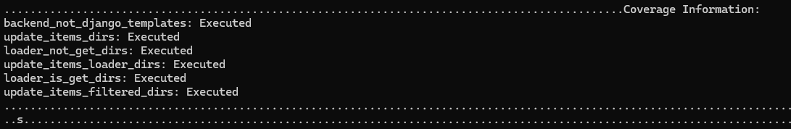

The branch coverage has improved to 100%. The reason for which this coverage has improved is because I have added an extra global class at the beginning of the file, 3 extra test cases in the temporary_migration_module function; one for a single `__path__`attribute (a test which was already there but I added once again anyway for the sake of uniformity), one for a `__file__`attribute within the module, and one for neither (empty). The two latter tested the remaining two branches. After re-running the coverage, here are the results in the html file: 

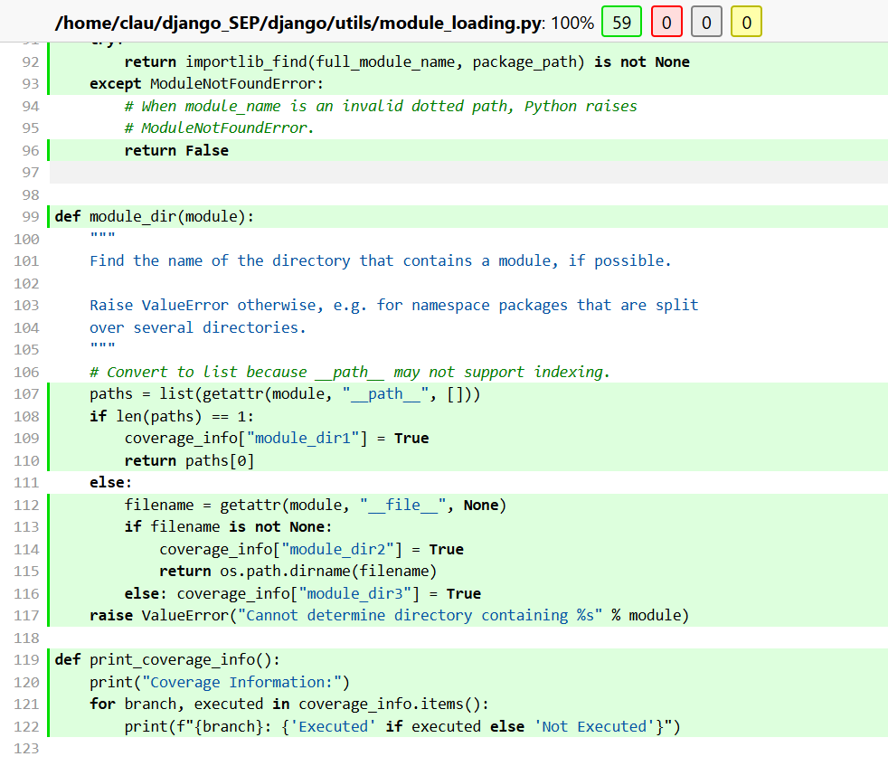


##### tests/template_tests/test_autoreloader.py -> test_get_template_directories

[Commit that shows the new / enhanced test](https://github.com/Aryansharma28/django_SEP/commit/64b6267f6102aad935945473c5711ce99b31ab7e)


For comparison, here are the old coverage results as shown above: 


For this function, my aim was to reach 100% coverage. Once I had identified which branch required further testing to achieve this, and implemented it as demonstrated in the link provided above, I ran the command again: 

`coverage run ./runtests.py --settings=test_sqlite template_tests`

From this, here are the new coverage results: 


The branch coverage has improved to 100%. The reason for which this coverage has improved is because I have added a mock loader class in which there is no get_dirs method, so that when the mock loader gets called in the function (as in the override settings it was listed as a test case possibility) this triggered the missing branch. After re-running the coverage, here are the results in the html file: 

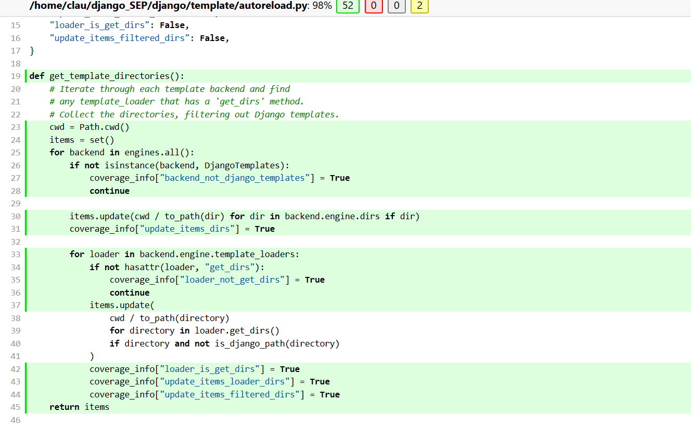

#### Aryan Sharma(ash288)

##### 1.C:\Users\aryan\Desktop\sep\django\tests\signed_cookies_tests\tests.py

Previously the the function had a 50% branch coverage and now we have got it to 100% coverage.Once I had identified which branches required further testing to achieve this, and implemented it as demonstrated in the link provided above, I ran the command again:
   
`coverage run ./runtests.py --settings=test_sqlite signed_cookies_tests`


For this function, my aim was to reach 100% coverage. Once I had identified which branch required further testing to achieve this, and implemented it as demonstrated in the link provided above, I ran the coverage tool again:


To acheieve 100% coverage. we first create a Django HttpRequest object to simulate a web request. We then test two scenarios for the get_signed_cookie method: one where we provide a default value for a non-existent cookie, and another where we don't provide a default. For the first scenario, we verify that the method returns the provided default value when the cookie doesn't exist. For the second scenario, we check that the method raises a KeyError when no default is provided and the cookie is missing. These tests ensure that the get_signed_cookie method handles missing cookies correctly, either by returning a default value or raising an exception as appropriate.

[relevant commit](https://github.com/Aryansharma28/django_SEP/commit/67e9e3f7e2c24ab9b9cd9241162dc609f4f4b5a0#diff-f0e5c460b951110bdc3b7967ed2a4c924ae8f093affc27cdd581939d18988725)
 
##### 2.\tests\auth_tests\test_tokens.py --> test_check_token_exceptions()

Previously the the function had a 80% branch coverage and now we have got it to 100% coverage.Once I had identified which branches required further testing to achieve this, and implemented it as demonstrated in the link provided above, I ran the command again:

coverage run ./runtests.py --settings=test_sqlite auth_tests

From this, here are the new coverage results:


The branch coverage has improved to 100%. This test function verifies the check_token method's ability to handle invalid tokens. It creates a test user and checks four scenarios: tokens without hyphens, with multiple hyphens, with invalid characters, and with valid format but invalid content. By asserting all cases return False, it ensures the method correctly rejects various types of invalid input, crucial for password reset security. after rerunning the coverage we can see that all the branches are now covered


[Commit to view tests](https://github.com/Aryansharma28/django_SEP/commit/67e9e3f7e2c24ab9b9cd9241162dc609f4f4b5a0#diff-bc4d1f01b0cb354b10be00c5737ffaeca369fc62b0c691f0c01514eac98e8458)

## Statement of individual contributions
### Konstantinos Syrros (ksy201)
- Assisted in assessing the suitability of the project selected for the assignment.
- Provided help in setting up the project and testing environment to the team members.
- Instrumented the functions `__init__` and `open` of the  `EmailBackend` class in the `filebased.py` file of the `mail` module.
- Added test cases for the functions `__init__` and `open` of the  `EmailBackend` class in the `tests.py` file of the `mail` module.
- Increased the coverage of both functions to 100%.
- Structured and oversaw the quality completion of the report.

### Christina Benopoulou (cbe248)
- Actively participated in team discussions, asking clarifying questions and helping my team members
- Enhanced existing test cases by writing code for writable and readable functions
- Increased the coverage of both functions to 100%
  
### Maria Claudia Montalvo (cmo209)
- Increased the coverage of both functions 100%
- Instrumented and created further test cases for the `module_dir` function within the module_loading.py file
- Instrumented and created further test cases for the `get_template_directories` function in the autoreload.py file. 
- Aided other members of the team with short explanations, for instance regarding the necessary commands 
- Actively asked questions and did research in order to fully grasp the scope of the task 

### Aryan Sharma (ash288)
- Increased the coverage of both functions 100% by enhancing the test cases to ensure higher branch coverage
- actively participated in group discussions and attempted to add as much value to the team as possible.
- Researched and learnt a lot and shared a lot of knowledge regarding this assignment!
- Aided in completeing the report


