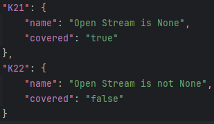
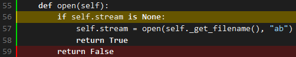

# Report for Assignment 1 - Group 10

## Project chosen

Name: **Django**

URL: **https://github.com/django/django**

Number of lines of code and the tool used to count it: we used Lizard to count the number of lines and the number of lines is 383659. However, excluding all other directories like `tests` and `docs`, by only focusing on the `django` directory and setting `-l python` in the Lizard arguments, the number of lines comes down to **112389**.
```bash
# The following assumes that we are currently in the root directory of the Django repository.
lizard django/ -l python
```

Programming language: **Python**

## Testing Framework
We have added this small section to the report, in order to provide some basic information of how the Django Test Suite functions.

Django provides a test suite that is used to test the Django codebase. The test suite is located in the `tests` directory of the Django repository. The test suite is run using the `runtests.py` script, which is located in the `tests` directory, and contains the hashbang to run with the default Python installation of the system.

The test suite supports options such as a `--settings` argument, which allows the user to pass some default settings for the Django environment. In our case, we are using the default settings provided by Django, `test_sqlite.py`, which include using an SQLite database, among others.

The test suite also supports a `--parallel` argument, which allows the user to set how many tests are set in parallel. The default value is calculated based on the available cores, however in some cases we have chosen to set this to `1`, due to conflicts with our custom coverage instrumentation. This will be mentioned explicitly, where used.

Finally, passing the name of a test module will run only the tests in that module. This is useful for running specific tests, as running the entire test suite can take time. For example, if one of us is working on the `mail` module, we can run only the tests in that module by running `./runtests.py mail --settings=test_sqlite`.

## Coverage measurement

### Existing tool

We used **coverage.py** to check the coverage of the repository, and it turned out to be 78%.

We ran the following commands, as mentioned in the [Django Unit Test Documentation for Contributors](https://docs.djangoproject.com/en/dev/internals/contributing/writing-code/unit-tests/#code-coverage):
```bash
# The following assumes that we are currently in the root directory of the Django repository, and in the created virtual environment.
cd tests
pip install coverage
pip install -e ..
pip install -r requirements/py3.txt
coverage run ./runtests.py --settings=test_sqlite # Runs the tests with coverage and using the SQLite adapter.
coverage combine # Combines the coverage data from all the test runs.
coverage html # Generates the HTML coverage report.
```
[//]: # (<Show the coverage results provided by the existing tool with a screenshot>)


The above yields the following coverage report, accessible at tests/coverage_html/index.html:


### Your own coverage tool

#### Konstantinos Syrros (ksy201)

##### /django/core/mail/backends/filebased.py : EmailBackend -> \_\_init\_\_

The relevant function is the `__init__` function of the `EmailBackend` class in the `filebased.py` file. The function is responsible for initializing the `EmailBackend` class for Django to have a dummy email backend, where all emails are treated as locally stored files. The function essentially carries out all required actions regarding the directory where the email files are to be stored.

Due to the nature of the tests and this function, I ran across the issue where the class was getting initialized multiple times. The parallel nature of the tests also did not help when trying to get a consistent coverage. Even when putting the coverage datastructure outside the class as global, I would still come across inaccurate results. Thus, I opted for the following:
- Store the datastructure in an external JSON file called `my-coverage.json`, load it every time the function is called, and update it accordingly.
- Use `--parallel=1` when running the tests, in order to avoid issues with the parallel nature of the tests, both when it comes to the coverage itself and the file operations.
- The aforementioned JSON file will get updated, and for reproducibility, I have also included the original `my-coverage-base.json` file alongside. The process is to copy the base file to `my-coverage.json` before running the tests. While this is not the most efficient way to handle the coverage, and creating a wrapper tool to encapsulate and handle all this, as well as output everything in a more user-friendly manner, would be the ideal solution, I believe that it falls outside the scope of this assignment, and would come closer to recreating the structure of `coverage.py`.

[Relevant Commit](https://github.com/Aryansharma28/django_SEP/commit/aeba14c6156b3700f2039d986cd2a989f5886b58)

In the above commit you can see the instrumentation of both Function 1 and Function 2, since they were instrumented at the same time.

The results of the instrumentation can be seen below:


It can be seen that they indeed reflect the coverage, as measured by `coverage.py`:


The initial coverage of this function was 50%.

##### /django/core/mail/backends/filebased.py : EmailBackend -> open

This function is part of the same file and class as the previous function. The `open` function is responsible for opening the file (stream) where the email is to be stored. I chose to follow the same instrumentation technique as described earlier.

[Relevant Commit](https://github.com/Aryansharma28/django_SEP/commit/aeba14c6156b3700f2039d986cd2a989f5886b58)

In the above commit you can see the instrumentation of both Function 1 and Function 2, since they were instrumented at the same time.

The results of the instrumentation can be seen below:



It can be seen that they indeed reflect the coverage, as measured by `coverage.py`:



The initial coverage of this function was 50%.

## Coverage improvement

### Individual tests

<The following is supposed to be repeated for each group member>

#### Group Member Name (VUnet ID)

##### /path/to/test/file/test1_name

<Show a patch (diff) or a link to a commit made in your forked repository that shows the new/enhanced test>

<Provide a screenshot of the old coverage results (the same as you already showed above)>

<Provide a screenshot of the new coverage results>

<State the coverage improvement with a number and elaborate on why the coverage is improved>

##### /path/to/test/file/test2_name

<Provide the same kind of information provided for Test 1>

### Overall

<Provide a screenshot of the old coverage results by running an existing tool (the same as you already showed above)>

<Provide a screenshot of the new coverage results by running the existing tool using all test modifications made by the group>

## Statement of individual contributions

<Write what each group member did>
